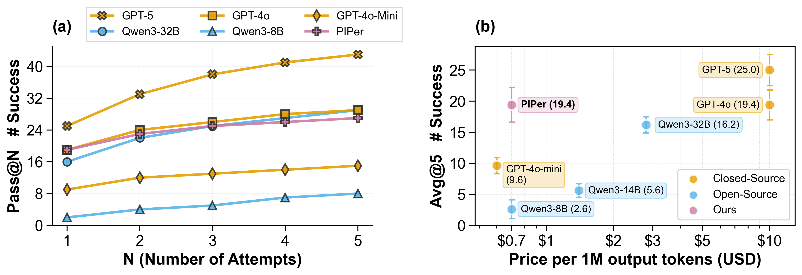

# 🚀 PIPer: On-Device Environment Setup via Online Reinforcement Learning

<div align="center">

[](https://huggingface.co/PIPer-iclr)
[](https://huggingface.co/datasets/PIPer-iclr/envbench-zeroshot-rl)
[](LICENSE)

*Democratizing environment setup with on-device sized models that match the performance of much larger proprietary systems*

</div>

## 🎯 Overview

Environment setup—the process of configuring systems to work with specific software projects—remains a persistent challenge in software engineering. **PIPer** addresses this by training specialized on-device models that can automatically generate correct Bash scripts for environment configuration.

Our approach combines:
- 📚 **Supervised Fine-Tuning (SFT)** with executable scripts from larger models
- 🎯 **Reinforcement Learning with Verifiable Rewards (RLVR)** using lightweight proxy LLM-reward

## 🏆 Key Results

| Model | Size | EnvBench avg@5 | Cost per 1M tokens |
|-------|------|----------------|-------------------|
| **PIPer** | 8B | **19.4** | $0.60 |
| GPT-4o | - | 19.4 | $15.00 |
| Qwen3-32B | 32B | 16.2 | $2.00 |
| Qwen3-8B | 8B | 2.6 | $0.60 |

> 🎉 **PIPer achieves 9× improvement** over its base model while **matching GPT-4o performance** at **25x lower cost**



## 📦 Available Artifacts

### 🤖 Model Checkpoints

| Model | Description | HuggingFace Link |
|-------|-------------|------------------|
| **🏅 PIPer (Full)** | Complete SFT+RL trained model | [PIPer-iclr/PIPer-8B](https://huggingface.co/PIPer-iclr/PIPer-8B) |
| 🎯 PIPer (RL-only) | RLVR checkpoint only | [PIPer-iclr/PIPer-8B-RL-only](https://huggingface.co/PIPer-iclr/PIPer-8B-RL-only) |
| 📚 PIPer (SFT-only) | Supervised fine-tuning only | [PIPer-iclr/PIPer-8B-SFT-only](https://huggingface.co/PIPer-iclr/PIPer-8B-SFT-only) |

### 📊 Datasets

| Dataset                   | Description                                            | HuggingFace Link                                                                                    |
|---------------------------|--------------------------------------------------------|-----------------------------------------------------------------------------------------------------|
| **EnvBench Zero-shot RL** | Training prompts and evaluation data                   | [PIPer-iclr/envbench-zeroshot-rl](https://huggingface.co/datasets/PIPer-iclr/envbench-zeroshot-rl)  |
| **EnvBench SFT 2500**     | Zeroshot trajectories from Qwen-32B in ShareGPT format | [PIPer-iclr/PIPer-SFT-2500-sharegpt](https://huggingface.co/datasets/PIPer-iclr/PIPer-SFT-2500-sharegpt)  |
| **PIPer Eval**            | Full evaluation results for EnvBench and Repo2Run      | [PIPer-iclr/PIPer-eval](https://huggingface.co/datasets/PIPer-iclr/PIPer-eval/tree/main)  |


## 🚀 Reproduce the results
We use [uv](https://docs.astral.sh/uv/) for dependency management and [Ray](https://docs.ray.io/en/latest/ray-core/ray-core.html) for distributed training.

```bash
git clone https://github.com/PIPer-iclr/PIPer.git
cd PIPer
git submodule update --init --recursive
uv sync
```

To run the experiments, you need a node with at least 4 H200 GPUs and [Ray](https://docs.ray.io/en/latest/ray-core/ray-core.html) installed and running.
Then you can run all the experiments with the following command:

```bash
uv run piper/hparams_entrypoint.py --multirun +experiment==llm-reward
```

You can look up the experiment [Hydra](https://hydra.cc/docs/intro/) configurations in `piper/config/` folder, or print out the whole config with the following command:

```bash
uv run piper/hparams_entrypoint.py +experiment=llm-reward --info config
```

## 📊 Evaluation Benchmarks

| Benchmark | Description | Metric | Our Result |
|-----------|-------------|---------|------------|
| **EnvBench-Python** | 329 Python repositories | pass@5 | 🏆 **27/329** |
| **Repo2Run** | 420 Python repositories | pass@5 | 🏆 **103/420** |
| **Terminal-Bench** | 80 terminal tasks | pass@10 | **4/80** |

## 📄 License

This project is licensed under the MIT License - see the [LICENSE](LICENSE) file for details.
